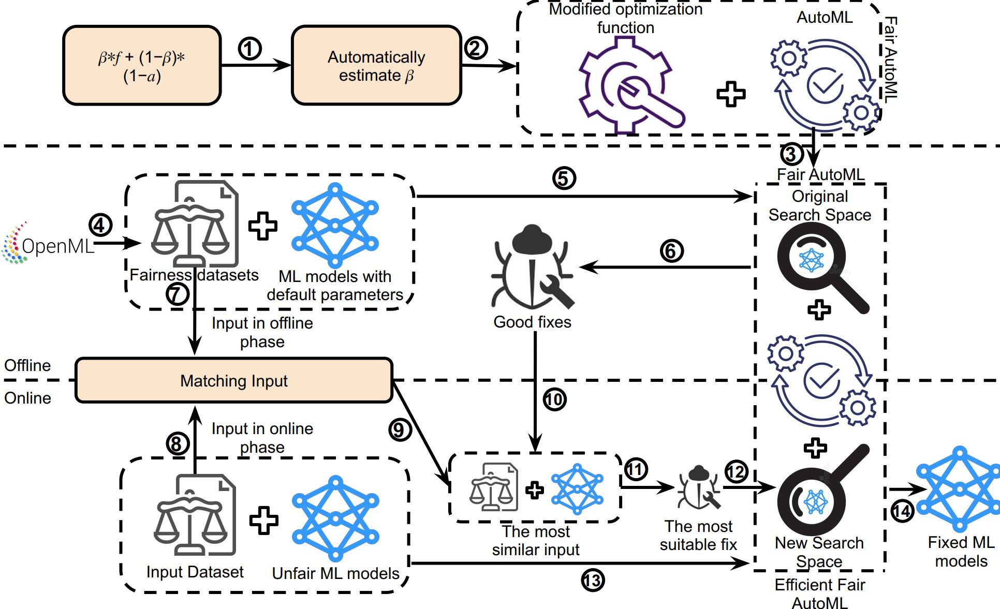

# Fair-AutoML
This repository contains the source code, benchmark models, and datasets for the paper - **"Fix Fairness, Don’t Ruin Accuracy: Performance Aware Fairness Repair using AutoML"**, appeared in ESEC/FSE 2023 at San Francisco, California, United States.

### Authors
* Giang Nguyen, Iowa State University (gnguyen@iastate.edu)
* Sumon Biswas, Carnegie Mellon University (sumonb@cs.cmu.edu)
* Hridesh Rajan, Iowa State University (hridesh@iastate.edu)
  
### Abstract
Machine learning (ML) is increasingly being used in critical decision-making software, but incidents have raised questions about the fairness of ML predictions. To address this issue, new tools and methods are needed to mitigate bias in ML-based software. Previous studies have proposed bias mitigation algorithms that only work in specific situations and often result in a loss of accuracy. Our proposed solution is a novel approach that utilizes automated machine learning (AutoML) techniques to mitigate bias. Our approach includes two key innovations: a novel optimization function and a fairness-aware search space. By improving the default optimization function of AutoML and incorporating fairness objectives, we are able to mitigate bias with little to no loss of accuracy. Additionally, we propose a fairness-aware search space pruning method for AutoML to reduce computational cost and repair time. Our approach, built on the state-of-the-art Auto-Sklearn tool, is designed to reduce bias in real-world scenarios. In order to demonstrate the effectiveness of our approach, we evaluated our approach on four fairness problems and 16 different ML models, and our results show a significant improvement over the baseline and existing bias mitigation techniques. Our approach, Fair-AutoML, successfully repaired 60 out of 64 buggy cases, while existing bias mitigation techniques only repaired up to 44 out of 64 cases.



**PDF** https://arxiv.org/abs/2306.09297

Fair-AutoML is an extension of Auto-Sklearn, which is used to repair fairness bugs.

* The source code of this work is built on top Auto-Sklearn.
* To reproduce the results, run files in the "evaluation" folder. Each file contains the dataset, buggy models, and the pruned search space. The name of each file represents "dataset + ML algorithm + fairness metric."
* The dataset can be found in the "dataset" folder.

## Index
> 1. Datasets
  >> * [Adult Census](dataset/adult)
  >> * [Bank Marketing](dataset/bank)
  >> * [German Credit](dataset/german)
  >> * [Titanic](dataset/titanic)
> 2. Evaluation source code
  >> * [Adult Census](evaluation/adult)
  >> * [Bank Marketing](evaluation/bank)
  >> * [German Credit](evaluation/german)
  >> * [Titanic](evaluation/titanic)

## Installation

To run Fair-AutoML, we need to install Python 3 environment on Linux. 
The current version has been tested on Python 3.10. 

### Environment Setup
Follow these steps to clone the Fair-AutoML repository and install Fair-AutoML.

1. Clone this repository and move to the directory:

```
git clone https://github.com/giangnm58/Fair-AutoML.git
cd Fair-AutoML/
``` 

2. Navigate to the cloned repository: `cd Fair-AutoML/` and install required packages:

```
pip install -r requirements.txt
```

To run the tool, please refer to the [installation file](/INSTALL.md) for detailed instructions. 

### Cite the paper as
```
@article{nguyen2023fix,
  title={Fix Fairness, Don't Ruin Accuracy: Performance Aware Fairness Repair using AutoML},
  author={Nguyen, Giang and Biswas, Sumon and Rajan, Hridesh},
  booktitle = {ESEC/FSE'2023: The ACM Joint European Software Engineering Conference and Symposium on the Foundations of Software Engineering},
  location = {San Francisco, California, United States},
  month = {December 3 - December 9},
  year = {2023},
  journal={arXiv preprint arXiv:2306.09297}
}
```
